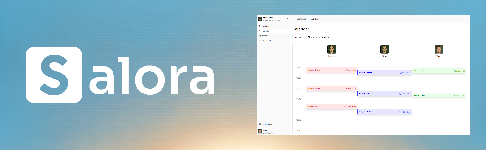

  

   
   

  

    
    
    
  

---

# Salora Core

> **Note:** Salora Core is currently in active development (Alpha). Features, database schemas, and APIs are subject to change. It is not yet recommended for production use out of the box and requires technical setup.

Salora is a modern, open-source booking management system designed for service-based businesses. Built from the ground up to be embedded into existing platforms, it provides a robust foundation for scheduling, resource management, and customer relations. 

Originating as a passionate project to solve scheduling complexities in the Netherlands, the platform is actively transitioning to a fully internationalized (i18n) architecture for global deployment.

## Features

- **Embeddable Widget:** A drop-in, dependency-free booking UI designed to integrate seamlessly into existing websites (WordPress, Shopify, Wix) or custom frontends.
- **Availability Engine:** Core scheduling logic handling real-time availability, dynamic time-slot generation, and conflict prevention.
- **Resource Management:** Comprehensive scheduling for multi-staff environments, including variable working hours, custom breaks, and specific service assignments.
- **CRM & Client Portal:** Centralized management for appointments, customer history tracking, and automated status workflows.
- **Edge-Optimized:** Designed to run on serverless edge networks for low latency and high availability.

## Tech Stack

Salora is built on a modern, performant monorepo stack:
- **Frontend & Core:** SvelteKit (TypeScript)
- **Backend API:** tRPC for end-to-end type safety
- **Database:** PostgreSQL with Prisma ORM
- **Runtime & Tooling:** Bun and Turborepo
- **Deployment:** Optimized for Cloudflare Workers (Edge)

## Documentation

For full installation instructions, architectural overviews, and API references, please visit the official developer documentation:

**[https://docs.salora.app/docs](https://docs.salora.app/docs)**

## Docker Deployment Modes

The repository now supports two Docker Compose deployment modes:

- Infrastructure only (PostgreSQL + Redis)
- Full stack (PostgreSQL + Redis + frontend + widgets)

Infrastructure only:

docker compose up -d

Full stack:

docker compose --profile full up -d --build

Stop services:

docker compose stop

Tear down services and volumes:

docker compose down -v

Notes:

- The full stack builds from the monorepo root so workspace dependencies resolve correctly.
- For external deployments, provide your environment variables in a .env file before running compose.

## Architecture & Licensing

Salora operates on an Open Core model. This repository contains the fundamental booking logic, widget interfaces, and base UI components.

This core project is licensed under the **AGPLv3 License**. This means that if you modify and host this software over a network, you must publicly share your source code under the same license. For proprietary use cases that conflict with copyleft restrictions, dual-licensing options are available.